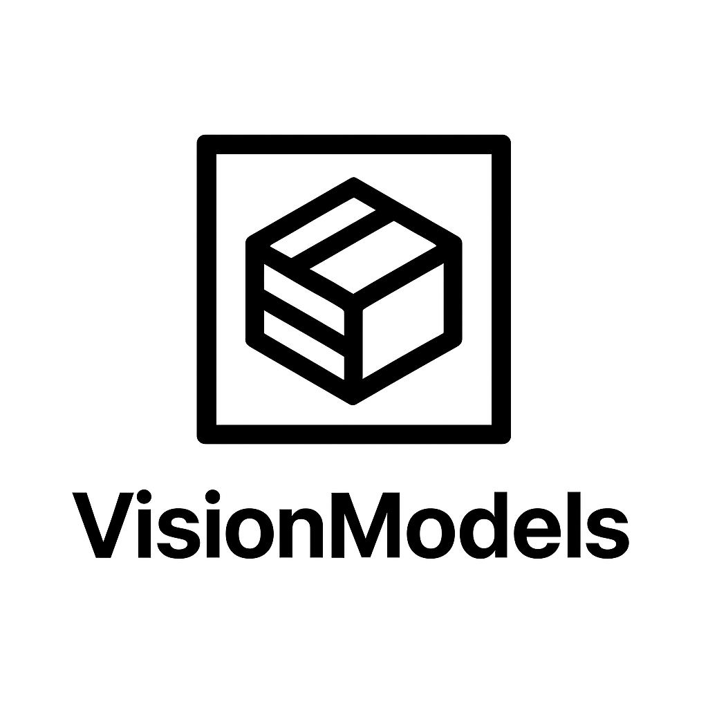
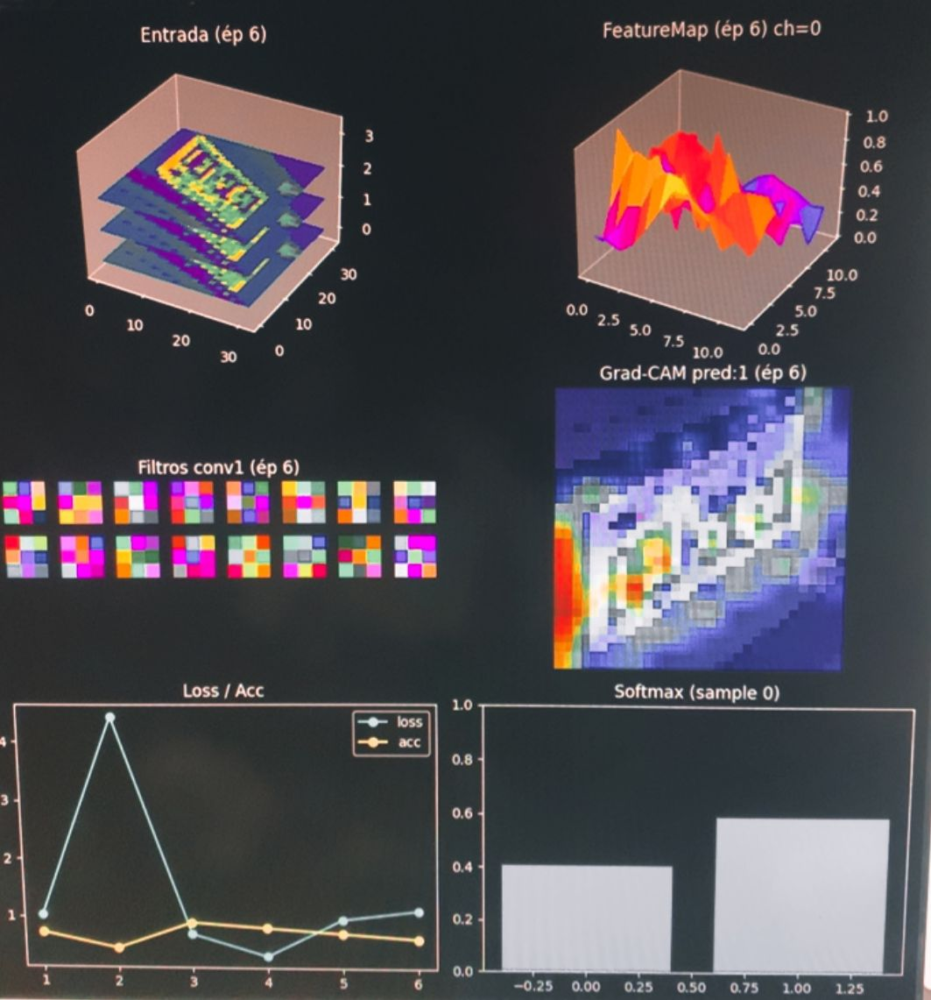

# VisionModels




repositório público contendo vários modelos já treinados, convertidos
para TensorFlow.js e prontos para uso, sem necessidade de instalar
Python, TensorFlow, GPU ou fazer conversões complicadas.\
Coleção de modelos especializados prontos para uso direto no navegador,
WebView ou qualquer ambiente compatível com TensorFlow.js.

O objetivo deste repositório é simples:\
fornecer modelos treinados, leves e específicos,

Não há código de treinamento aqui --- somente os modelos finais, já
convertidos para TFJS, para serem usados imediatamente.

## O que você encontra neste repositório

Cada modelo fica em sua própria pasta:

    models/
     └── license_plate/
          ├── model.json
          ├── group1-shard1.bin
          ├── labels.json  (opcional, quando existir)
          └── README.md    (detalhes do modelo)

✔ Modelos enxutos\
✔ TFJS GraphModel pronto para carregar\
✔ Labels quando necessário\
✔ Documentação por modelo (opcional)

## Como usar um modelo

Carregue diretamente no navegador ou no React Native WebView:

``` js
const model = await tf.loadGraphModel(
  "https://raw.githubusercontent.com/SEU_USER/SEU_REPO/main/models/license_plate/model.json"
);
```

Rodar predicação:

``` js
const tensor = tf.browser.fromPixels(image).resizeNearestNeighbor([224,224]).toFloat().expandDims(0);
const prediction = await model.predict(tensor);
console.log(prediction);
```

## Lista de modelos disponíveis

``` code

| Modelo        | Descrição                          | Link                   |
| ------------- | ---------------------------------- | ---------------------- |
| license_plate | Detector / classificador de placas | ➜ models/license_plate |
| car           | Classificador de veículos          | ➜ models/car           |
| home          | Classificador de ambientes         | ➜ models/home          |
| ...           | ...                                | ...                    |

```

## Por que isso existe?

Porque muitas pessoas precisam de modelos prontos, sem se preocupar com:

❌ Treinamento\
❌ Configurar ambiente\
❌ GPU\
❌ Converter para TFJS\
❌ Lidar com shards

Aqui você entrega tudo já compatível com web e mobile.

Ideal para:

-   Aplicações mobile (React Native Expo / WebView)
-   Dashboards\
-   Edge AI\
-   Estudos e testes rápidos\
-   Automação\
-   Projetos low-code / no-code



##  Atualizações

Novos modelos serão adicionados conforme forem treinados.

Cada modelo pode incluir:

-   Histórico de versões\
-   Precisão / métricas\
-   Labels\
-   Observações de uso

##  Licença

MIT --- livre para uso.

##  Contribuições

Você pode abrir issues para:

-   Sugestões de novos modelos\
-   Correções nos arquivos\
-   Melhorias na documentação

Pull requests com novos modelos não serão aceitos, pois apenas o autor
treina os modelos.
